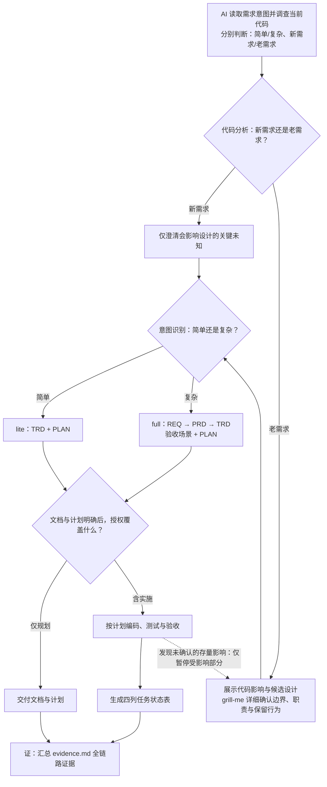

# AI Coding 工作流约定

目标：团队能读懂并对齐，AI 能沿明确的契约实施。按可独立验收的小功能推进，规范随真实使用迭代；使用项目已有的开发与测试工具，不绑定特定模型、代理接口或第三方工作流。

## 基本设计原则

- **人类和 AI 都可读。** 文档用清晰的业务语言说明问题、规则和设计；DSL 使用明确结构、稳定编号和可解析引用。两者表达一致，读者不依赖历史聊天或特定模型也能理解并执行。
- **充分思考，适度设计。** 前期尽量梳理完整的业务场景、异常与风险，明确团队协作中的职责、交付边界、接口契约和依赖关系；重大技术决策记录方案取舍、影响与待决问题。文档深度按需求复杂度选择，风险决定调查与验证的深度：简单需求使用精简规格，高风险也要写清影响与措施；目标、关键契约和验收标准必须明确；不为假想需求预建架构或堆砌流程。
- **可迭代。** 按需求小步完善文档、规格和实现，允许规范随实践演进；优先细化当前要做的工作，提前识别影响后续协作和重大决策的约束。保留稳定标识和 Git 历史，破坏性变更说明版本与迁移方式。
- **可维护。** 每份文档职责清楚，同一事实只维护一处，其他地方通过引用关联。文档、DSL、测试与代码同步更新；保持简约，避免重复副本、无价值字段和不必要的流程。

本工作流自身的设计文档统一维护在 `AICoding/design-docs/`。下文的目标项目 `doc/<需求目录>/` 指使用工作流开发业务功能时的产物目录，不是本工作流设计文档的存放位置。

<a id="routing"></a>
## 需求分流与执行流程

AI 先读取需求意图与当前代码，分别给出两个结论，并在 TRD 中记录依据：**简单或复杂决定写哪些文档，新需求或老需求决定如何询问与确认。**



两个结论在开始时独立判断，图中先处理新老需求的询问方式，再展示对应的文档路径。调查、候选设计、提问与文档可以交替完善，不要求所有文档定稿后才询问；新需求没有关键未知就直接完善文档，老需求随共识逐轮明确代码设计。仅授权规划时，到交付文档与计划为止。

| 判断 | AI 的依据 | 执行结果 |
|---|---|---|
| 简单需求 | 意图集中，业务规则和实现路径清楚，协作关系少 | `lite`：由 trd-writer 维护 TRD＋PLAN 两份设计与计划源 |
| 复杂需求 | 存在多组业务规则、交互分支、模块协作或复杂实现 | `full`：req-writer → prd-writer → trd-writer，完成需求、产品、技术、验收场景与计划全部文档 |
| 新需求 | 分析代码、调用关系和测试，确认新增能力不改变既有行为、接口契约或数据语义 | 文档明确且已获实施授权就按计划执行，仅询问会影响设计的关键未知 |
| 老需求 | 分析发现会改变既有行为、接口、共享逻辑或调用方兼容性 | 必须详细询问，确认具体改动、代码设计边界与职责后执行 |

新旧结论依据实际代码影响，不使用需求名称或标题作为分类条件。证据不足时继续调查；仍无法排除存量影响的部分按老需求处理。混合需求分别记录新旧部分，复杂度仍按整体需求意图判断。

简单但高风险的需求仍可使用 lite，在 TRD 写明风险、影响角色与范围、验证和应对措施，文档说明即可。老需求即使资料完整也要取得本次细节确认；已确认的相同细节直接复用。实施中发现新的存量影响时，只暂停并确认受影响部分，其余独立且已授权的工作可继续。

仅授权规划时交付文档与计划；实施授权覆盖且属于已确认边界内的实现，由 AI 自主推进。业务规则、范围或外部契约变化时，对变化部分重新对齐。

<a id="existing-confirmation"></a>
## 老需求：详细询问与代码设计确认

先读相关代码、文档和测试，形成可审阅的影响说明，再分组、分轮提问。由 AI 查明技术事实，用户决定业务意图；不让用户猜测代码现状。

说明应具体到本次改动所需的内容：

- **现状与落点：** 文件路径、函数或接口、当前行为；改哪里、如何改，以及必须保留的行为。
- **边界与职责：** 各模块、类/函数分别负责什么，职责之间如何调用；哪些代码允许修改、哪些必须保持，相关团队或调用方的协作边界。
- **接口与代码设计：** 新增或变化的接口输入、输出、失败结果和必要副作用；实现落点、关键执行步骤及受影响调用方，让人明确知道改哪里、如何改。
- **风险与验证：** 边界和异常、回归范围、发布方式与失败后的恢复措施；不适用的项简要说明原因。

通过 grill-me 按问题依赖分轮确认：同轮只问前置结论已明确的问题，依赖本轮答案的问题留到下一轮。先确认影响范围和行为，再结合候选设计确认模块职责、代码边界、接口、验证及发布恢复中的必要决定。每轮只问仍需用户判断的问题。已有本次明确确认直接引用，未查清的事实继续调查，避免把核对清单变成机械审批。

调查证据、确认结论与未决事项记录在 TRD 的“影响与确认”一节。涉及已有产品规则时，规则正文更新到所属权威文件，TRD 只记录变更影响并引用；保持事实只有一份。未经确认的受影响部分暂不实施，其余独立工作继续。

## 文档职责与唯一来源

业务文档按用户需求组织：**目标项目根目录** `doc/<需求目录>/`，需求目录采用 `req-r<至少两位编号>-<英文名称>`，例如 `req-r01-profile`，即 `doc/req-【需求】/`，其中【需求】用稳定编号与名称替换。`/doc` 在交流中指项目目录，不是操作系统根目录。

```text
doc/
├── req-r01-profile/            # 简单需求：lite
│   ├── technical.md            # TRD：目标、规则、验收、设计与影响确认
│   ├── plan.yaml               # 任务来源，mode: lite
│   ├── evidence.md             # 各环节的上下文、输入、输出、结果与证据
│   ├── plan.md                 # 自动生成的阅读计划
│   └── task-status.md          # 最后验收生成的四列状态表
└── req-r02-order/              # 复杂需求：full
    ├── requirement.md          # 用户需求：问题、目标、范围
    ├── product.md              # 产品行为与规则
    ├── technical.md            # TRD：概要、详细设计、测试与影响确认
    ├── acceptance.feature      # 可执行验收场景
    ├── plan.yaml               # 任务来源，mode: full
    ├── evidence.md             # 各环节的上下文、输入、输出、结果与证据
    ├── plan.md                 # 自动生成的阅读计划
    └── task-status.md          # 最后验收生成的四列状态表
```

先检查现有需求目录再分配编号；编号在项目内唯一、不复用，同一需求后续迭代继续维护原目录。名称使用小写 kebab-case，确定后保持稳定。历史交给 Git，不按每轮复制整套文档。

目录编号 r01 标识一项用户需求；目录内部的 R01、S01、T01 分别标识可验收子项、场景和任务。跨需求引用写完整限定名，如 `req-r01-profile/R01`。DSL 的 `feature` 字段与工具的 `--feature` 参数填写完整需求目录名，不增加目录层级。

### lite：两份设计与计划源

`technical.md` 是 TRD，由 trd-writer 统一维护本轮目标与范围、带 R 编号的业务规则/基线引用、验收场景、概要与详细设计、测试设计和影响确认。验收放在带 `<a id="acceptance"></a>` 锚点的章节中，使用文档内唯一的 `gherkin` 围栏代码块，场景仍有稳定 S 编号并引用 R。纯文档等无行为任务可省略该块，但任务须写 `scenarios: []` 和具体 `tdd_exception`，并保留适当验证证据。

`plan.yaml` 以 `mode: lite` 指定文档契约，维护当前迭代的任务、依赖、引用、修改范围、验证命令、状态和证据摘要；trd-writer 规划，coder 更新实施结果，验收人据实际结果核验。任务引用 TRD 中的规则、场景和接口，不复制正文。

lite 的设计与计划仅维护这两份源；另在 `evidence.md` 记录全链路过程证据，阅读计划和任务状态表自动生成。风险与措施写入 TRD，任务证据摘要维护于 DSL；手工验收及审查记录由 evidence.md 链接到实际结果。精简的是文档组织，不是行为测试：涉及行为的任务必须有 Gherkin 场景及对应真实测试。

### full：按职责分工

| 文件 | 权威内容 | 主要维护角色 |
|---|---|---|
| `requirement.md` | 问题、目标、用户、范围与非目标、约束、需求编号 R01 | 需求负责人 / req-writer |
| `product.md` | 对应 R01 的业务规则、操作流程、交互、状态、异常反馈、配置语义 | 产品负责人 / prd-writer |
| `technical.md` | 概要与详细设计、公共/跨模块接口、关键实现步骤、测试设计、影响与确认 | 技术负责人 / trd-writer |
| `acceptance.feature` | Gherkin 验收例子，稳定 S 编号并引用 R；涵盖有意义的正常、边界、异常行为 | prd-writer 维护，trd-writer 校对 |
| `plan.yaml` | 当前迭代任务及执行记录，字段职责与 lite 一致 | trd-writer 规划 / coder 更新，验收人核验 |

full 同样维护 `evidence.md`，汇总跨阶段、手工验收与审查的可定位证据。各文件概述并链接上游，规则正文只在职责所属文件维护。例如名称长度在 `product.md` 定义，场景用边界例子验证，TRD 说明实现，任务引用相应编号。

### 两种模式共用的生成视图

- `plan.md`：从 DSL 生成团队阅读计划，展示任务顺序与追溯关系，不手工修改。
- `task-status.md`：最后验收的独立状态视图，仅含任务编号、名称、状态、备注四列，由 e2e-validator 组织生成，不另建手工任务数据。

测试例子须保留必要输入与断言，不因唯一来源原则而删去。两种模式均由 `plan.yaml` 明确任务来源，生成视图不承担业务或任务事实的维护职责。

<a id="iteration"></a>
## 迭代承接与文档深度变化

同一需求持续维护原 `doc/req-【需求】/` 目录，`mode` 表示本轮文档路径。新一轮先核对原需求、TRD、未完成任务与代码现状，再根据本轮意图识别简单或复杂；已有文件数量不决定本轮必须重复编写哪些文档。

| 本轮情况 | 编写范围 | 来源与当前事实 |
|---|---|---|
| 大需求中的小迭代（full → lite） | TRD 只更新本次迭代的目标、规则变化、技术设计和验收；更新 PLAN 与 evidence.md，不重写整套需求/产品文档 | TRD 引用原需求编号、原文档路径/锚点与可复核版本。原 REQ/PRD/场景文件保留为基线，本轮有效规则由原基线加 TRD 明确的变化构成，不复制全部历史设计 |
| 小需求扩展为大需求（lite → full） | 引用原小需求 TRD 的文档编号，重新编写本轮完整 REQ、PRD、TRD、验收场景和 PLAN，更新 evidence.md | 全文档承接原 TRD 中仍有效的事实、已确认变化与扩大范围；旧内容作为有版本的输入，本轮权威事实按 full 的文档职责维护 |
| 文档深度不变 | 更新本轮相关内容；未受影响的规则、设计与证据直接引用 | 不因迭代重编号，也不按轮次复制整套文件 |

TRD 使用稳定文档编号 `TRD-<需求目录>`，例如 `TRD-req-r01-profile`，在 technical.md 头部标明并使用 `trd` 锚点；它由需求目录派生，不另建编号系统。引用具体版本时同时注明迭代与 Git 基线提交，例如 `TRD-req-r01-profile` 的迭代 01、基线 `<commit>`；需求子项仍使用 `req-r01-profile/R01`，文档编号不能代替 R/S/T。

重写同一路径前记录原 TRD 的编号、来源与版本；有 Git 基线时可用 `git show <commit>:doc/req-r01-profile/technical.md` 复核，不能把指向重写后当前文件的链接当作原版本证据。未提交输入在 evidence.md 中保留必要原文摘录、来源和版本状态，不伪造提交引用，也不为留证擅自提交。

full → lite 时，本轮引用的 R 锚点、Gherkin 场景和设计入口放在 TRD；锚点正文可引用原规则并写明本轮变化。已有基线中仍需校验的前置任务也保留必要引用和场景，不以 TDD 例外绕过行为验证。lite → full 时保留已有 R/S/T，将本轮有效规则与场景按 full 职责归位；完成承接后，原 TRD 版本仅作为历史来源，不维护第二份当前规则。切换不自动改业务范围，涉及存量行为仍按确认协议执行。

### 跨轮任务承接

`plan.yaml` 包含本轮要执行的任务，以及它们所需的已完成前置任务及其传递依赖。未完成任务沿用原编号结转；若决定退出或推迟到本轮之外，先明确范围调整，再在 evidence.md 记录原 ID、原因、确认依据和后续安排，不能静默消失。新增工作使用未使用过的新编号，不将旧 ID 改作另一项工作。

必要前置任务保留原 `done`、设计/场景引用和仍有效的证据，在 remark 标明“前轮依赖基线，非本轮新增成果”；无关历史留给 Git。当前模式必须能解析计划中每项保留任务的 R/S/设计引用，不能留下悬空依赖。新工作依赖它们，不等于必须重做它们；先核对基线与当前代码/契约是否匹配，仅在变化、失效或覆盖疑点时复验。

任务状态表列出本轮计划全部条目，包括明确标注的必要前置基线，仍只有四列。切换 iteration 前确认未完成项的去向与引用闭合，更新本轮上下文、证据和生成视图。

<a id="rework"></a>
## 验收打回与依赖恢复

当任务完成条件失效，验收方会同协调记录者先定位被打回任务及其全部直接、间接依赖任务，在同一轮记录更新中将这些任务标为 `blocked`，备注写明被打回原因或“上游打回，待复验”。独立任务保持原状态；这里只调整执行与验收状态，不自动回滚代码。

将旧 GREEN/REVIEW 的来源保留在 evidence.md 并明确标记失效或待复验，清除这些任务在 DSL 中已不能代表当前结果的 green/review，不能拿旧成功摘要恢复 done。完成状态或前置条件被打回后，不保留依赖它的 doing/done 状态；CLI 会拒绝这种不一致状态。

先修复被打回任务，记录真实验证和审查；其前置条件满足后按 `blocked → doing → done` 推进。上游恢复后，按依赖顺序让后续任务进入实施或复验，验证相关契约及保留行为后再恢复 done，不机械重做未变化的实现。汇总本轮失败、修复、复验和遗留问题，再执行 render、status、check，未全部通过也如实交付。

<a id="collaboration"></a>
## 并行执行与记录归并

按依赖和文件冲突决定并行。同一需求有多个执行者时，在分工开始前指定一名协调记录者，由其统一写入 `plan.yaml`、`evidence.md` 并生成 plan.md/task-status.md。其他执行者只修改分配给自己的实现文件，回传任务 ID、改动、真实命令/结果、证据位置和阻碍，不并发覆盖公共记录。

协调记录者核对结果与当前代码、合并状态后再校验生成；发现同一事实冲突先核实，不以最后写入者为准。串行执行时可由当前执行者兼任，不引入额外锁服务或固定代理模型。

## 接口共识

`technical.md` 分为概要设计与详细设计。概要说明改动位置、模块职责、数据流及重要取舍；有实际争议才比较方案，不机械凑两个选项。

详细设计覆盖本轮新增或变化的 HTTP、RPC、公共及跨模块接口。每个接口使用稳定显式锚点，如 `<a id="api-01"></a>`，说明：

- 入口/方法与签名、输入字段类型、必填性、校验和默认值。
- 输出类型与语义、错误/失败结果、可见副作用、权限与状态变化。
- 实现落点、关键执行步骤；有必要时写事务、并发、幂等、重试及算法边界。
- 关联的需求和验收场景；已有契约直接链接权威定义，无需重复维护。

没有新接口的改动使用实现章节锚点。普通私有函数留给实现者；不得为补模板凭空增加架构、后端字段或业务前提。

## 一轮迭代

1. **调查并分流。** AI 从需求意图判断简单或复杂，从当前代码及调用关系判断新需求或老需求，在 TRD 记录依据；新旧不依据需求名判断。
2. **形成可审阅结果。** 简单需求的设计与计划只维护 TRD＋PLAN 两份源；复杂需求依次完成需求、产品、技术、验收场景和计划全部文档。结合调查和提问迭代草案，写明代码设计边界、接口及验证入口，校验并生成阅读计划。
3. **按实际共识开始。** 存量受影响部分须完成细节确认；新逻辑文档明确且已获授权即可执行。已有明确确认不重复，未决事项只阻塞其影响部分。
4. **逐任务实现。** 依赖完成后开始；先写有意义的失败测试，再实现并通过测试，必要时重构。按真实依赖和文件冲突决定是否并行，不固定每任务一代理。
5. **核验并记录。** 用实际执行结果与审查核对场景、契约和代码。更新 DSL 状态、备注和证据，重新生成计划；最终验收生成独立任务状态列表并检查一致性；文档、DSL、测试与代码在同一变更中保持一致。
6. **提交与持续维护。** 有提交授权时按有意义的任务边界提交。未获授权时准备可审阅 diff 并明确未提交；push、合并、部署按各自授权处理。完成后继续在原需求目录维护，历史由 Git 保存。
7. **证：全链路证据。** 各环节进行时更新 `evidence.md`，交付时汇总核对上下文、输入、输出、结果及证据位置。仅规划也交付已有阶段记录，未授权实施的环节明确标为未执行；不能在结束时凭计划补写成功记录。

若文档与 DSL 语义冲突，以职责所属文档查明意图并修正；涉及已确认业务或契约变化时，仅澄清相关差异。自动校验只能检查结构、引用与状态条件，不能证明语义一致、存量影响判断正确或测试真实执行。

## 可执行的含义

AI 读取 `plan.yaml`、引用设计和场景，用宿主已有工具实施。Gherkin 场景绑定真实测试代码/步骤，由项目测试程序执行。生成器只读文件并生成 Markdown，**不会运行 YAML 中的命令、调用模型或自动改业务代码**。

测试框架按项目实际情况选择，不强制安装 Cucumber。使用其他框架时，场景 ID 必须映射到可定位、可执行的测试；仅把 Gherkin 解析成功或让 AI 阅读，不能称为验收通过。缺少测试基础设施时，将最小测试入口列入任务，不假设命令已存在。

<a id="right-bicep"></a>
## 测试用例设计：RIGHT-BICEP

RIGHT-BICEP 用来识别有效测试用例，与 RED → GREEN 的实施顺序配合使用。每轮对六个维度逐一考虑，按实际行为和风险选择有价值的用例；同一用例可以覆盖多个维度，不要求每个接口机械凑齐六组测试。

| 维度 | 要回答的问题 | 落地要求 |
|---|---|---|
| Right · 正确结果 | 核心逻辑的结果是否正确？ | 依据已确认规则断言精确结果、状态与必要副作用；不能只断言非空或没有抛错。 |
| B · Boundary 边界 | 边界条件是否正确？ | 检查最小/最大值及两侧、空值、空集合、畸形输入等适用边界；非法输入要验证约定的反馈。 |
| I · Inverse 反向关系 | 能否利用反向操作校验？ | 在适用前提下检查加/减、编码/解码等往返关系；有损转换或不可逆行为不能强行套用。 |
| C · Cross-check 交叉验证 | 能否用独立方法验证结果？ | 使用独立实现、可信数据或手工计算样例作参照；不要用被测函数或同一错误逻辑生成预期结果。 |
| E · Error condition 错误条件 | 能否主动触发错误路径？ | 注入超时、依赖失败、非法状态等实际错误，验证错误结果、状态清理与约定的恢复行为。 |
| P · Performance 性能 | 响应时间和资源消耗是否可接受？ | 按已确认目标定义负载、环境、测量方式及阈值/基线，检查耗时、内存、调用次数等相关指标；不凭空规定毫秒门槛。 |

在 `technical.md` 的“测试设计”中记录适用维度及其场景/测试引用，可以用简短文字或紧凑表；不强制六行表，不适用项可合并说明原因。纯文档等无需行为测试的任务可统一说明，仍需验证与审查证据。业务可见验收行为在 lite 中维护于 TRD 的 Gherkin 块，在 full 中维护于 `acceptance.feature`；算法性质、错误注入和性能测试按项目测试层组织，不将所有单元测试都翻译成 Gherkin。

I/C 没有可靠前提或独立参照时说明原因；P 不适用时说明原因。若性能属于已承诺的验收目标但阈值或环境尚未确定，列为待确认/未验证，不能用“不适用”跳过。场景、任务与测试证据使用稳定编号，相关任务引用技术文档的测试设计锚点；测试维度统一维护在技术文档中。

规划时确定适用维度与用例，编码时实施并记录真实 RED/GREEN，验收时检查用例质量和实际结果。六个维度的结构检查不等于业务验收通过。

## RED / GREEN / 审查

- RED：执行新增或收紧的行为断言，记录命令、失败的场景/测试和预期失败原因。依赖缺失、语法错误、未定义步骤及“未执行”不算有效 RED。
- GREEN：记录实际命令、结果摘要及可复核的测试/日志位置。SKIP、空测试集、静态推断不等于通过。
- 无需运行测试的纯文档等任务填写 `tdd_exception` 理由，仍提供适当验证和审查证据。已有测试足以覆盖的修复说明为什么无需新 RED，不制造假失败。
- 测试只能证明已验证范围。移动浏览器、线上环境等未实际验证的部分如实列出，不用单元测试结果代替。
- 审查关注契约、实现正确性和测试能否发现回归；复杂或高风险改动使用可用的独立视角。不锁模型；无法独立审查时注明自审，不能冒称独立通过。
- 阻塞写清原因与下一步；修复失败按具体原因继续，不机械重跑同一套审查，也不因固定次数自动把问题甩回用户。

<a id="task-status"></a>
## 最后验收：任务状态列表

在需求目录生成独立的 `task-status.md`，路径为 `doc/req-【需求】/task-status.md`，例如 `doc/req-r01-profile/task-status.md`。它与该需求的 plan.yaml 放在同一目录，不集中存放多个需求的任务。

文件只显示以下四列；不增加标题、统计、执行日志或其他字段：

| 任务编号 | 名称 | 状态 | 备注 |
|---|---|---|---|
| T01 | 实现输入校验 | 未开始 | — |

上表仅为格式示例。实际文件由生成器读取本轮 `plan.yaml` 的全部任务，按依赖顺序生成；四列依次来自 id、title、status、remark，缺少备注显示“—”。状态显示为：todo → 未开始，doing → 进行中，done → 已完成，blocked → 受阻。

验收人先依据真实结果更新 DSL：未执行或未通过的任务不能标记已完成；失败、受阻及待验证事项在 remark 中简短说明原因与下一步，详细证据引用实际测试报告；全链路记录、手工验收和审查结论统一汇入 `evidence.md`，引用真实来源。即使未全部通过，也应如实生成该状态列表。

随后运行 `render`、`status`、`check`。列表不手工维护；后续任务状态或备注变化时重新生成。check 在列表存在时检查它是否过期，规划阶段尚未生成列表则只检查计划；最后验收必须先生成列表再 check。状态表是任务结果摘要，不代替业务验收和测试证据。

<a id="evidence"></a>
## 证：全链路证据

每个需求在 `doc/req-【需求】/evidence.md` 持续维护一份证据文档，例如 `doc/req-r01-profile/evidence.md`。lite 与 full 均须维护，从首个实际环节开始记录，交付前汇总；它是过程证据索引，不增加一份需求规格或重复任务状态。使用[统一证据模板](../.agents/skills/develop-work-flow/assets/evidence.md)，按真实发生的阶段记录，不预填成功结论。

每个环节写清 **上下文、输入、输出、结果、证据位置**：上下文说明本轮范围、必要前提和授权/确认依据；输入指向实际消费的需求、代码、规则或上游产物；输出指向实际形成的文件、代码、测试或审查结果；结果区分已核验、失败、未验证、未执行与不适用，并写明未决项；证据包含可定位的文档锚点、文件/函数、测试名称与命令、报告/日志、审查记录或 Git 引用。按需要记录时间、执行者/审查方式、代码版本及环境，让结果能对应到实际对象。

| 环节 | 记录责任 | 应能追溯的内容 |
|---|---|---|
| 调查与分流 | develop-work-flow 或首个实际执行的 skill | 用户诉求、代码事实、简单/复杂与新/老判断、授权和确认来源 |
| 需求与产品 | req-writer / prd-writer；lite 由 trd-writer 合并记录 | 需求及规则输入、确认范围、R/S 标识与产物；lite 注明合并于 TRD，不伪称运行了独立阶段 |
| 技术与计划 | trd-writer | 代码影响、职责与契约、设计依据、任务拆分及计划校验结果 |
| 实施与测试 | coder | T 任务对应代码、真实 RED/GREEN、命令和测试报告，或有依据的 TDD 例外 |
| 审查 | 审查调用方 | 实际审查范围、独立/自审方式、发现、处理与复核结果；reviewer 保持只读 |
| 验收 | e2e-validator | R/S/T 到实际验证的对应、通过/失败/未验证项、生成视图检查及遗留问题 |
| 提交与交付 | 提交者 / develop-work-flow | 已授权交付范围、现有提交或 Task trailer 查询依据，以及未提交/未发布状态 |

证据以引用为主：规则与设计正文仍在权威文档，任务状态和 red/green/review 摘要仍在 `plan.yaml`；evidence.md 补齐跨阶段上下文与证据入口，不复制维护这些事实。长日志保存在团队可访问的报告或仓库附件中，不以本机 `/tmp` 路径作为唯一长期凭据。用户确认要能定位到原始消息/工单；无法共享原会话时，保留确认时间、范围和必要摘录，并链接 TRD 中的结论。

各阶段的执行者更新自己负责的记录，已有阶段直接链接可核实资料；缺失或无法核实就如实标明，不根据文档齐全、计划命令或任务状态反推已执行。新迭代继续维护同一文件并注明迭代范围，历史由 Git 保存；已完成任务的证据因相关代码或契约变更失效时标明待复验。仅规划的实施/测试/验收标为未执行，真正不适用的阶段说明原因。

e2e-validator 在最终验收核对全链路：缺少应有输入/输出、证据不可定位、证据与当前版本不符或环节未核实，均不能宣称该部分通过，但仍交付真实记录和下一步。`validate/render/status/check` 不自动核验 evidence.md 的完整性或真实性，由 AI/人工审查；`task-status.md` 始终只保留四列。提交追溯沿用下节规则，不为写入自身提交 hash 反复修改本次提交中的 evidence.md。

## 追溯与 Git

`R01 → S01 → T01 → 测试证据 → Git 提交`。R、S、T 在同一需求目录内稳定且不复用；新一轮按[迭代承接](#iteration)更新 iteration 和任务集合，历史由 Git 保留。跨功能变更在各自功能文档维护对应规则，用技术文档链接说明协作关系；任务依赖在同一计划内校验；跨需求的交付依赖在技术文档中明确，并由协作双方对齐。

提交采用 Conventional Commits，正文带本次任务 trailer，例如：

```text
feat(profile): reject empty display names

Task: req-r01-profile/T01
```

一个提交可包含紧密关联的多个任务并逐行记录 Task；不强制分别提交 RED 和 GREEN，不为凑记录提交破损代码。当前提交不把自身 hash 写回自身文件，避免循环更新。按 Git 解析出的 `Task` trailer 完整值查询，不使用子串 grep，避免 T10 命中 T100 或提交正文中的提及。例如在业务项目根查询 T10：

```sh
git log --all --format='%H%x09%(trailers:key=Task,valueonly,separator=%x09)' |
  awk -F '\t' -v target='req-r01-profile/T10' '{ for (i=2; i<=NF; i++) if ($i == target) { print $1; break } }'
```

命中表示该提交包含完整的任务 trailer，不代表已合并或部署；未命中时明确记录未找到对应提交，不伪造 hash。

## 源码与文档管理

共享 skills、agents、代码与模板统一维护于 AICoding 的 `.agents/`；工作流规范、DSL 说明与设计依据维护于同仓库 `design-docs/`。业务项目通过目录软链接复用共享内容，并维护自身的 `doc/` 与业务代码。第三方 skills、工具及运行依赖安装在用户家目录，由其安装与更新机制管理。

工作流自身通过 Git 持续迭代。DSL 的 `schema` 显式标识格式版本，当前值为 1；只有破坏兼容性的格式变化才升级版本，并说明影响与调整方式。规模与风险决定所需机制，不预先建设多版本平台。

工具与字段见 [DSL 约定](<AI Coding 设计说明.md#dsl>)，起稿模板见 [lite](../.agents/skills/develop-work-flow/assets/lite/) 与 [full](../.agents/skills/develop-work-flow/assets/feature/)。
